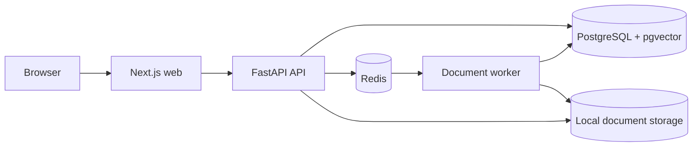

# OpsAI architecture

The web app owns presentation and browser configuration. The API owns validation,
business logic, and persistence access. PostgreSQL is the durable system of record;
Redis carries document jobs to the worker, and local storage holds generated-key
uploads outside the source tree. Shared TypeScript contracts remain intentionally
small until a cross-application use case exists.
