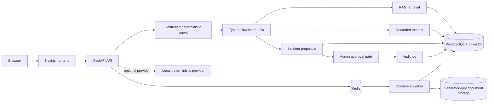

# OpsAI architecture

## Boundaries

The browser owns presentation and SSE rendering. FastAPI owns authentication,
validation, authorization, orchestration, persistence, and safe error handling.
The agent can select only typed allowlisted tools:

- `search_knowledge`
- `get_metric`
- `get_incident`
- `create_incident`

Knowledge retrieval is owner-scoped and similarity-thresholded. Metrics are
read-only persisted observations. Incident creation creates a proposal; an
administrator must approve an unexpired action before execution. Execution is
persisted atomically and idempotently, and every important state transition is
audited.

`POST /mcp` is an authenticated MCP-style JSON-RPC adapter exposing the same
service and tool implementations. It is intentionally documented as an adapter,
not as a standards-certified MCP server.

## Runtime dependencies

- PostgreSQL with pgvector stores durable application state and embeddings.
- Redis carries document jobs and supports rate limiting.
- The API exposes `/health` for cheap liveness/database status.
- The API exposes `/ready` for database and Redis dependency readiness.
- The worker consumes Redis jobs and writes processed document chunks.

## Development and delivery

The local deterministic provider is the default, so tests, evaluation, and CI
do not require `OPENAI_API_KEY` or another paid AI service. GitHub Actions runs
Ruff, formatting, mypy, pytest, Vitest, ESLint, TypeScript validation, and the
Next.js production build on pushes and pull requests.
