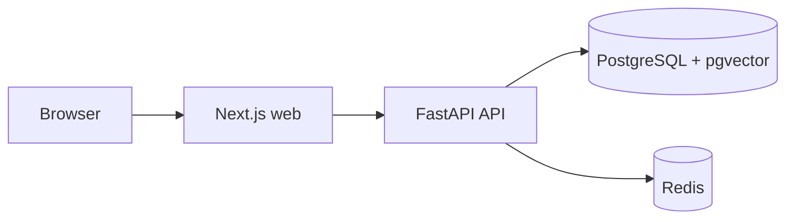

# OpsAI architecture

The web app owns presentation and browser configuration. The API owns validation, business logic, and persistence access. PostgreSQL is the durable system of record; Redis is a local dependency reserved for asynchronous work and caching. Shared TypeScript contracts remain intentionally small until a cross-application use case exists.
