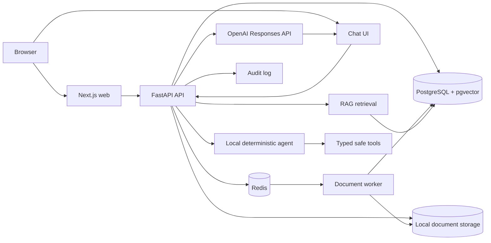

# OpsAI architecture



The local agent uses the same thresholded, owner-scoped retrieval implementation
and exposes allowlisted knowledge/metric/incident tools. Incident creation is
proposal-only; actions are persisted with ownership, expiry, approval, audit
events, and a database-protected one-time execution boundary.

The web app owns presentation and browser configuration. The API owns validation,
business logic, and persistence access. PostgreSQL is the durable system of record;
Redis carries document jobs to the worker, and local storage holds generated-key
uploads outside the source tree. Shared TypeScript contracts remain intentionally
small until a cross-application use case exists.

## Chat architecture

```text
Browser
   ↓
Next.js
   ↓
FastAPI
   ↓
Conversation Service
   ↓
RAG Retrieval
   ↓
LLM Provider
   ↓
SSE Stream
   ↓
Browser
```

```text
User
 ↓
Conversation
 ↓
Message
 ↓
Retrieval
 ↓
Documents
 ↓
Chunks
```
