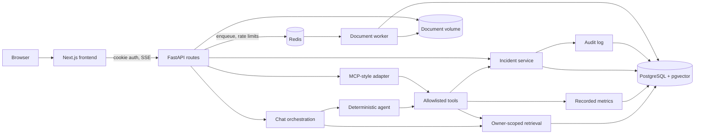

# OpsAI architecture


```mermaid
flowchart LR
    Browser[Browser] --> Web[Next.js frontend]
    Web -->|cookie auth, SSE| API[FastAPI routes]
    API --> Chat[Chat orchestration]
    Chat --> Agent[Deterministic agent]
    Chat --> Retrieval[Owner-scoped retrieval]
    Agent --> Tools[Allowlisted tools]
    API --> MCP[MCP-style adapter]
    MCP --> Tools
    Tools --> Retrieval
    Tools --> Metrics[Recorded metrics]
    Tools --> Incidents[Incident service]
    API --> Incidents
    Incidents --> Audit[Audit log]
    Retrieval --> Postgres[(PostgreSQL + pgvector)]
    Metrics --> Postgres
    Incidents --> Postgres
    Audit --> Postgres
    API -->|enqueue, rate limits| Redis[(Redis)]
    Redis --> Worker[Document worker]
    Worker --> Storage[(Document volume)]
    Worker --> Postgres
    API --> Storage
```

## Module boundaries

| Layer | Module | Owns |
| --- | --- | --- |
| HTTP | `app/main.py` | Authentication dependencies, request validation, HTTP status mapping, SSE framing, request logging |
| Orchestration | `app/chat.py` | Deciding, per message, between the agent and document retrieval; local and OpenAI answer providers; citations |
| Agent | `app/agent.py` | Mapping text to a closed set of typed intents and streaming tool events |
| Tools | `app/tools.py` | The allowlisted tool catalog shared by the chat, agent, and MCP adapter |
| Domain | `app/retrieval.py`, `app/incidents.py` | Owner-scoped vector search; proposals, approvals, execution, and audit |
| Ingestion | `app/ingestion.py`, `app/processing.py`, `app/worker.py` | Upload validation, storage, extraction, chunking, embeddings, and the queue |
| Adapter | `app/mcp.py` | JSON-RPC `tools/list` and `tools/call` over the same tools and RBAC |
| Operations | `app/manage.py`, `app/evaluation.py` | Role changes and demo metric seeding; offline regression evaluation |

Routes do not contain business rules. The incident service enforces roles, conversation
ownership, expiry, and state transitions, so the API, the agent, and the MCP adapter
cannot disagree about them. Services raise `PermissionError` (403), `LookupError` (404),
or `ValueError` (409 for state conflicts); routes translate those into HTTP responses.

## Chat request flow

1. `POST /conversations/{id}/messages` checks the rate limit and conversation ownership,
   stores the user message, and opens an SSE stream.
2. `chat.stream_reply` classifies the message. Metric, incident, lookup, and
   action-request intents go to the agent; everything else searches only the caller's
   completed documents.
3. Events are streamed as `tool_call`, `tool_result`, `approval_required`, `token`,
   `citation`, `error`, and `done`. The assistant message is persisted before `done`.
4. If anything fails after streaming has started, the session is rolled back, the
   failure is audited, and the client receives `error` followed by
   `done {status: "failed"}`. Internal error details are never streamed.

## Approval state machine

```text
            approve (admin)              execute (admin)
 pending ─────────────────▶ approved ─────────────────▶ executed
    │                          │                          ▲  (repeat execute returns it)
    │ reject (admin)           │ window elapsed           │
    ▼                          ▼                          │
 rejected                   expired ◀── pending, window elapsed at approval time
```

- Approval and execution lock the action row (`SELECT … FOR UPDATE`) and reload it, so
  a request that loaded the action earlier cannot act on stale state.
- An administrator repeating their own decision gets the recorded decision back; any
  decision from another administrator on an already-decided action is a 409.
- Executing an executed action returns it unchanged; `rejected`, `pending`, and
  `expired` actions cannot be executed.

## Retrieval

Documents are chunked by character window with overlap, embedded, and stored in
pgvector. A query is embedded the same way, ranked by cosine distance within the
caller's completed documents, and kept only above `RETRIEVAL_SIMILARITY_THRESHOLD`.
With the default local hash embedding, a chunk must also share at least one content
word with the question, because function words alone can clear the threshold. The
README's Limitations section covers the trade-offs.

## Runtime dependencies

- PostgreSQL with pgvector stores all durable state and embeddings.
- Redis carries document jobs and fixed-window rate-limit counters. Rate limiting fails
  open when Redis is unavailable; `/ready` reports that state.
- The worker consumes jobs from a Redis list (at-most-once delivery) and survives
  transient Redis and database errors.
- `/health` checks the API and database; `/ready` checks the database and Redis.

## Development and delivery

The local deterministic providers are the default, so tests, evaluation, and CI do not
need `OPENAI_API_KEY` or any paid service. CI runs Ruff, formatting, mypy, pytest, and
the evaluator; a Postgres job with migrations, `alembic check`, a downgrade round trip,
and the Postgres integration tests; Vitest, ESLint, TypeScript, and the Next.js
production build; and Compose validation.
